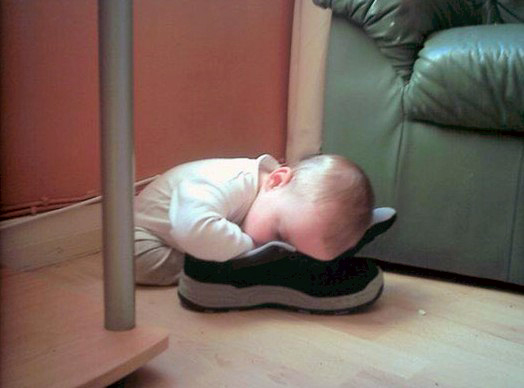
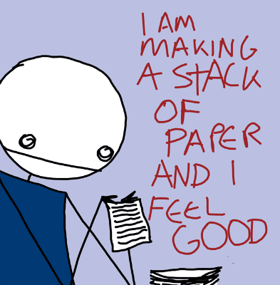

!SLIDE

    Ruby saved me from depression
    Jevin Maltais (@jevy)
    Ottawa, Canada

!SLIDE
# The hard years #

!SLIDE incremental
Engineering degree (2007) - 25 years old

!SLIDE center

!SLIDE bullets incremental small

* Became a lead developer (!) supervising 5 contractors
* Attended multiple cool conferences 
* Had my own office with an oak door
* Could listen to Above & Beyond as much as I wanted 
* Making lots of $$$ (for a 25y)
* Had the latest possible equipment

!SLIDE
# One problem... #

!SLIDE
# I wasn't happy. #

!SLIDE
# At all. #

!SLIDE center
# I was really tired all the time #

!SLIDE
.notes So I starting asking myself....

# I had no motivation #

!SLIDE

# "Why?" #

!SLIDE
# "Why do I feel this way?" #

!SLIDE
# "I have everything!!" #

!SLIDE bullets incremental

# What was wrong?

* I didn't feel my work was important
* The work wasn't fun (huge Java project)
* The work politics/gossip were horrible

!SLIDE center

!SLIDE bullets incremental
# THE LESSON 

If you use feel unhappy.  Ask yourself:

* Why am I unhappy?
* Did I have a good sleep? (Alex says it's important)
* Is is just a single bad day?
or
* Is it my environment?
